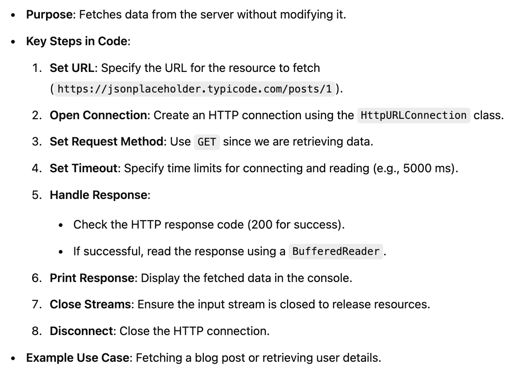
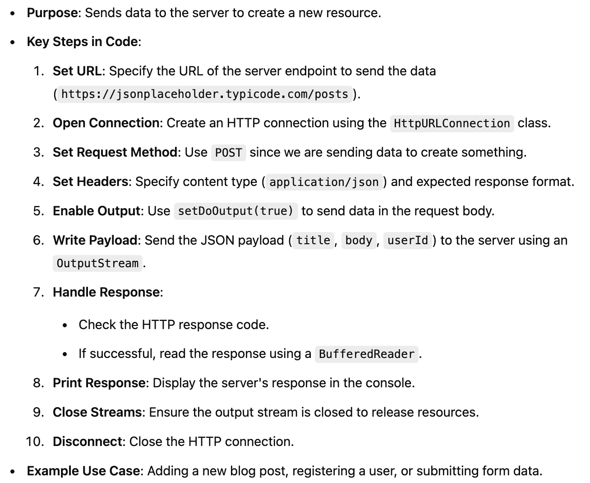
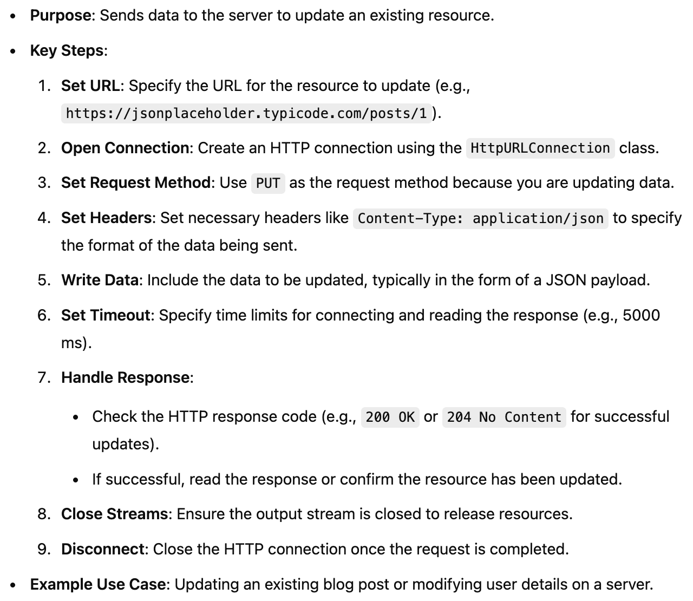
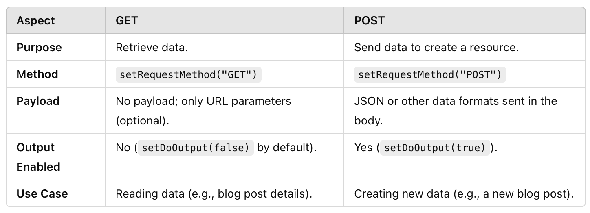

# ScalaRestApiClient
A simple Scala project demonstrating how to make HTTP requests (GET and POST) to RESTful APIs using Java's HttpURLConnection. 
This project provides a practical example of handling API responses, including parsing JSON data, error handling, and managing timeouts. 
It's designed to help developers get started with Scala-based HTTP clients for interacting with web services.

## 1. GET Request

## 2. POST Request

## 3. PUT Request

## Key Differences Between GET and POST in Code

